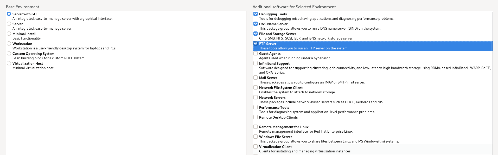
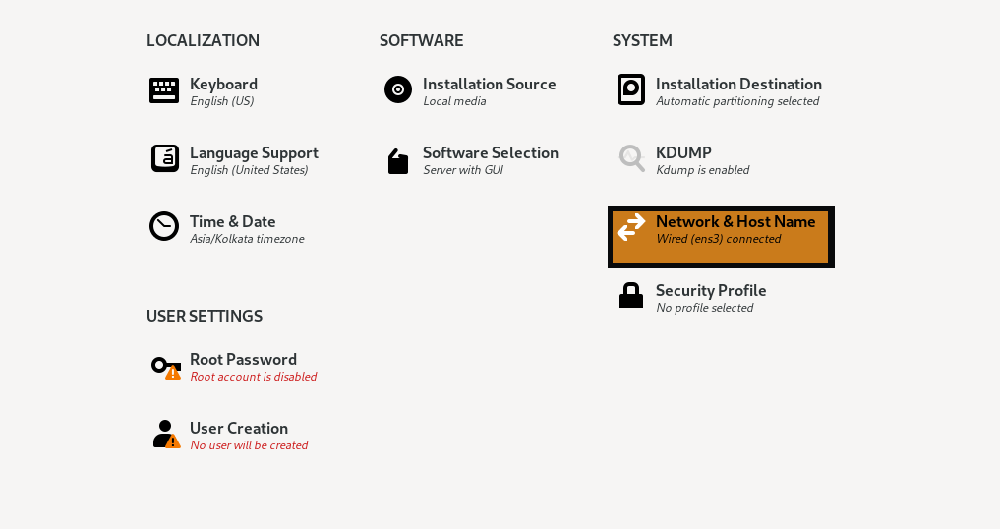
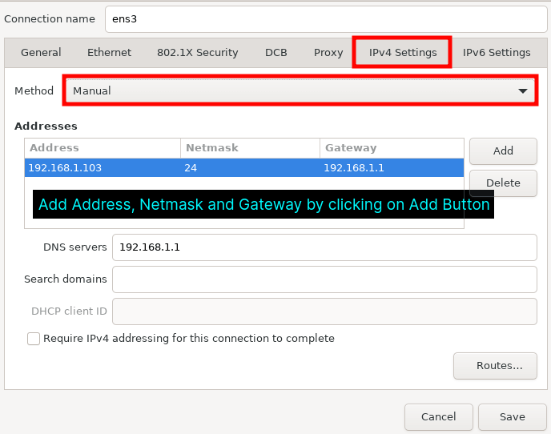

### Installing CentOS Stream 9

If your system meets all the requirements and you are okay with changes to **CentOS Stream**, we can process the installation. Let’s start with Downloading ISO and booting.


#### Step 1: Downloading CentOS Stream 9 ISO

First, visit its official page to [download CentOS Stream 9](https://centos.org/stream9/). Once you are done with the download part, you can use any [USB bootable tool](https://www.tecmint.com/linux-bootable-usb-creators/) such as **Rufus**, **balenaEtcher**, or **Ventoy** for flashing it on your drive (for bare-metal installation).

Now, boot from your bootable drive, and you will meet with the following screen. Choose the first option which will start the installer.


**CentOS Stream Boot Menu**


#### Step 2: Choose Installer Language

**CentOS Stream** uses the **Anaconda** installer which is one of the rare installers which has a separate prompt just for selecting installer language. You can choose what comforts you the most but for the majority, **English** will be the correct option and we are going with that.


**CentOS Stream Language**


#### Step 3: Setting Up Localization

In this step, we are going to configure all the available options under the **Localization** section which are **Keyboard**, **Language Support**, and **Time & Date**. Let’s Start with **Keyboard**.

Select **Keyboard** Option.


**CentOS Stream Keyboard**

Now Click on **Language Support** where we can choose additional languages required by the user to work.


**CentOS Stream Language Support**

From here you can choose the additional language you want to get supported on your system. I only use **English** so I’m going with default options.


Select the last option in **Localization** labeled “**Time & Date**” to choose our region.


**CentOS Stream Time and Date**

Form here, choose your region and city and click on Ok.


**CentOS Stream Timezone**


#### Step 4: Setting Up Software Options

In this step, we are going to choose the software required for our system. We will not make any changes to the installation source as it will automatically detect the local media. So let’s start with the **Software** selection.

Click on the 2nd option labeled as “**Software Selection**”.


**CentOS Stream Software**

From here you can select the important tools you require. In our case we select minimal install



**CentOS Stream with GUI**


#### Step 4: Choose Installation Drive

Click on **Installation Destination** which will direct us to the available disks.


**CentOS Stream Installation Destination**

Select the desired disk. You have two options for partitioning your drive: **manual** and **automatic**. We would suggest **automatic** partitioning as it handles the size well but if you want to customize partitions, you can choose the other option.


**CentOS Stream Automatic Install**


#### Step 6: Setting Network and Hostname


In this step, we are going to allocate the hostname to our system including setting up networking. Click on “**Network & Hostname**”.



**CentOS Stream Network**

If you are using **Ethernet**, you just have to enable it by the given button. To allocate the **hostname**, you are given a separate section. In my case, I’m going to use **tecmint**.


**CentOS Stream Network Configure**

In case you are not using **DHCP**, click on **Configure** which will direct us to set up our network manually. From here, click on **Ipv4** and choose the **Manual** method. Add your desired **Address**, **Netmask** and **Gateway** by clicking on **Add** button. In the end, add **DNS** and save the configuration.



**CentOS Stream Manual Network Configure**


#### Step 7: Create a User Account

To create a user, click on the **User** creation option which will direct you to a prompt where you are going to add users and create a password.


**CentOS Stream User Account**

Enter details such as Full name, password, etc. If you want, you can make this user administrator by giving the option. We always recommend you use a strong password.


**CentOS Stream User Details**

Once you are done with adding a user, Select “**Root Password**” which will allow us to create a root password for our existing user.


**CentOS Stream Root Password**


**Create Root Password**

Click on **Begin** installation button and it will start the installation process. Once the installation is complete, click on **Reboot** System.


**Begin CentOS Stream 9 Installation**

 - Log in to the CentOS system as the root user or a user with root privileges.**
 - Open a terminal or SSH into the CentOS system.
  
      ```ssh user@Ipaddress```

- Add the user to the "wheel" group by running the following command,
replacing `username` with the actual username of the user you want to grant sudo privileges to:

```usermod -aG wheel username```

- Verify that the user has been added to the "wheel" group:
- 

         ```id username```

- Now, the user should have sudo privileges. They can use the `sudo` command to run commands with root privileges.
- For example, the user can run:
```sudo command```


- Now enable LibeEdit-Devel

```bash
sudo dnf install libedit-devel
```


## Enable the CRB repository for CentOS 9 Stream

1. Open a terminal on your CentOS 9 Stream system.

2. Use the following command to install the `epel-release` package, which includes the Extra Packages for Enterprise Linux (EPEL) repository:


3. Once the `epel-release` package is installed, you can use the following command to install the `dnf-plugins-core` package, which includes the `config-manager` command:


4. After installing the `dnf-plugins-core` package, you can use the following command to enable the CRB repository:

5. Finally, you can use the following command to verify that the CRB repository is enabled:

This command will display a list of the enabled repositories on your system, including the CRB repository.

The CRB repository should now be enabled on your CentOS 9 Stream system.
